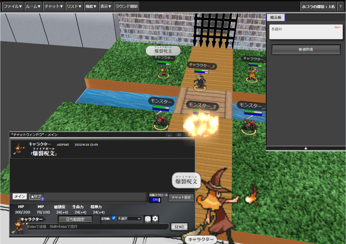

# Udonite
  
P2P通信であることを辞めサーバ・クライアント方式に切り替えたユドナリウム  
  
ユドナリウム(うどん元素)が一箇所に固まりユドナイト(うどん鉱石)になる  
ユドナイトという名前には分散型のP2Pからサーバ式に変わったという意味合いを込めています  

  
## 特徴
  
  ユドナイトはサーバー・クライアント式に変更したユドナリウムです。  　　
  通常のユドナリウムと下記の点が異なります。　　
  　　
  * データは全てサーバーに保存されます。音楽以外の全てのデータは次回セッション時に持ち越されます。  
  * 2D/3Dの切り替え機能  
  * 画面内の好きな位置で立ち絵を表示可能  
  * プレイヤー情報を保持します。ルームを作成したプレイヤーはルームを管理する権限が付与されます。 
  * ゲームキャラクターの情報を他のプレイヤーに伏せることができます。 
  * ゲームキャラクターがフリーテキストのメモ欄をステータスとは別に持ちます。  
  * ラウンド・カウンター管理  
  * 透過モード(伏せられたカード・ダイス・ゲームキャラクターの情報をルームマスターが確認可能なモード) 
  * タブ式チャットパレット「パレットバインダー」。複数のキャラクターを一つのパネルで切り替えることが可能です。
  * リソース管理機能。チャット画面から選択したキャラクターのリソースを変更可能です。  
  * 更新通知付きの掲示板機能。  
  * 視覚的なアラーム機能。  
  * 画面上を指示するポップアップメッセージ機能。 
  * イニシアティブ補正値の実装  
  * 消耗リソース管理機能  

## 今後の修正計画

  * ルームマスター権限でできることの拡張  
  * カード機能再設計      
  
  長期的には下記の改修をできないか検証しています  

  * ゲームオブジェクトとチャットデータの分離  
  * ３D表示の3d-transformからWEBGLへの移行  
  
  ここにないものでも、要望等あれば気軽に連絡してください  
  
## 設置

別途 Udonite-Serverを動かす必要があります

assets内config.yaml.templateをconfig.yamlにリネームして使ってください  
bcdice-apiサーバはv2対応のサーバを必ず記載してください  
  
## その他
Udonite作成にあたり下記作者様のコードを利用させていただいています。  
* ユドナリウム本家  
<https://github.com/TK11235/udonarium>  
* UdonariumWithFly  
<https://github.com/NanasuNANA/UdonariumWithFly>  
* ユドナリウムリリィ  
<https://github.com/entyu/udonarium_lily>  
  
  
