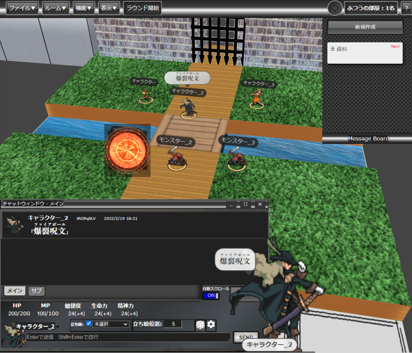

## Udonite
  
P2P通信であることを辞めサーバ・クライアント方式に切り替えたユドナリウム  
  
ユドナリウム(うどん元素)が一箇所に固まりユドナイト(うどん鉱石)になる  
ユドナイトという名前には分散型のP2Pからサーバ式に変わったという意味合いを込めています  

  
  
# 変更点
  
* P2P接続を廃止。サーバー・クライアント式に変更
* メインメニュー再構成  
* チャットウィンドウ再構成  
(背景色変更可能、文字サイズ変更可能)  
* bcDiceを外部のbcDice-api専用に変更  
* チャットパレットをタブ式チャットパレット　パレットバインダーに統合  
* １キャラクターが複数のチャットパレットを所持できるように変更  
* 共有メモのオーバービューサイズ調整機能  
* ラウンド管理機能  
* カウンター管理機能  
* リソース管理機能  
* エフェクト表示機能  
* ルーム管理権限を有効にすることにより、部屋の上書きやデータダウンロード、ログのダウンロードの制御が可能に  
* メッセージボード機能（画面上に常に表示されている共有メモ）  
* プレイヤー切断検知  
* アラーム 
* 音楽をBGMとSE同時に鳴らせるように機能追加、音楽個別にボリューム設定して、名前も変更できるように
* 新規キャラクターを作成するときのテンプレートを指定可能
* マップ上の任意の場所にメッセージをだせるように。
表示された時に音がなり、15秒で消える
* チャットメッセージ編集機能
* プレイヤー情報をセーブ＆ロード
* 画像・音楽データの削除
  
# 今後の修正計画

・3D表示の負荷軽減(試験中)
・部屋作成時に3Dと2Dを選択できるように(試験中)  
・チャットタブ単位でプレイヤーに閲覧権限つけたい  
・カード機能再設計  
・チャットログ表示をもう少し改善したい  
  
# 設置

別途 Udonite-Serverを動かす必要があります

assets内config.yaml.templateをconfig.yamlにリネームして使ってください  
bcdice-apiサーバはv2対応のサーバを必ず記載してください  
  
# その他
Udonite作成にあたり下記作者様のコードを利用させていただいています。  
* ユドナリウム本家  
<https://github.com/TK11235/udonarium>  
* UdonariumWithFly  
<https://github.com/NanasuNANA/UdonariumWithFly>  
* ユドナリウムリリィ  
<https://github.com/entyu/udonarium_lily>  
  
  
